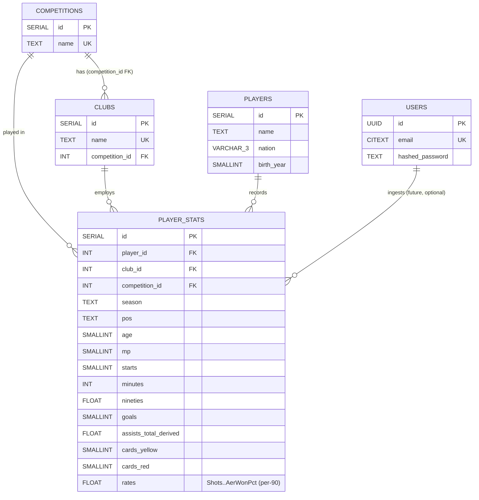

# Ballers API — Players DB Design / Schema

> Source: `dataset/players/2022-2023 Football Player Stats.csv`
> Stack: Postgres + Async SQLAlchemy (`asyncpg`) + FastAPI
> Scale target: 100k requests/day (~1.2 rps avg, ~10–20 rps peak)

## 1. Source dataset profile

| Property | Value |
|---|---|
| File | `2022-2023 Football Player Stats.csv` |
| Encoding / delimiter | `cp1252`, `;`-delimited (UTF-8 read fails) |
| Shape | 2689 rows × 124 columns |
| Competitions | 5 — Ligue 1 (565), La Liga (550), Serie A (544), Premier League (540), Bundesliga (490) |
| Squads | 98 |
| Unique players | 2530 (∼159 transferred mid-season → 2 rows each, e.g. Aubameyang: Chelsea + Barcelona) |
| Season coverage | Partial season, max 23 MP (snapshot ~Jan/Feb 2023, not a full 38-game season) |
| Positions | 10 variants: `DF, MF, FW, FWMF, MFFW, GK, DFMF, MFDF, DFFW, FWDF` |
| Nations | 3-letter codes, top: ESP, FRA, GER, ITA, ENG |

### Critical semantics: totals vs per-90 rates

Most columns are **per-90 rates**, a few are **totals**. Mixing them up is the #1 bug source.

- Totals: `Rk, Age, Born, MP, Starts, Min, 90s, Goals, CrdY, CrdR, 2CrdY`
- Per-90 rates: everything else (`Shots, SoT, Assists, PasTotCmp, SCA, GCA, Tkl, Touches, Carries, Recov, AerWon, ...`)
- Proof: Haaland `Assists=0.16` over `90s=18.2` → `0.16 × 18.2 ≈ 3` actual assists.
- Rule: never `SUM()` a rate across a transferred player's rows. Re-derive totals as `SUM(rate × 90s)`.

## 2. Design decisions

1. **Grain = player × club × competition × season**, not player. One CSV row = one fact row.
2. **Normalize identity, keep facts wide.** `Player/Squad/Comp` strings repeat hundreds of times — extract to dimension tables. The ~110 stat columns stay in one wide fact table (one ingest, one index set; splitting into shooting/passing/defense/possession tables is 6× work with zero gain at 2.7k rows).
3. **Position and age live on the fact row**, not the player row — both change per season/club.
4. **Multi-season ready from day one** via `season TEXT` in the grain. New season = new rows, no DDL change.

## 3. ER diagram



## 4. Tables

### 4.1 `players` — WHO (2530 rows)

Deduped humans.

| Column | Type | Constraints | Notes |
|---|---|---|---|
| `id` | `SERIAL` | `PRIMARY KEY` | Surrogate key, used by API as `/players/{id}` |
| `name` | `TEXT` | `NOT NULL` | e.g. `Erling Haaland`, `Kylian Mbappé` (cp1252 → UTF-8 on ingest) |
| `nation` | `VARCHAR(3)` | `NULL` | e.g. `NOR, FRA, ESP` |
| `birth_year` | `SMALLINT` | `NULL` | From `Born` col (e.g. `2000`) |

- `UNIQUE(name, nation, birth_year)` — names alone collide.
- Index: trigram/GIN on `name` for `GET /players?q=haal` autocomplete.
- `Pos` is deliberately NOT here (varies per row: `FW` vs `FWMF`).

### 4.2 `competitions` — WHICH LEAGUE (5 rows)

| Column | Type | Constraints |
|---|---|---|
| `id` | `SERIAL` | `PRIMARY KEY` |
| `name` | `TEXT` | `UNIQUE NOT NULL` (`Premier League`, `La Liga`, `Serie A`, `Ligue 1`, `Bundesliga`) |

### 4.3 `clubs` — WHICH TEAM (98 rows)

| Column | Type | Constraints |
|---|---|---|
| `id` | `SERIAL` | `PRIMARY KEY` |
| `name` | `TEXT` | `UNIQUE NOT NULL` (e.g. `Manchester City`, `Paris S-G`, `Reims`) |
| `competition_id` | `INT` | `NOT NULL REFERENCES competitions(id)` |

Safe because no club spans two leagues in one season.

### 4.4 `player_stats` — WHAT HE DID (2689 rows)

Grain: one row per `(player_id, club_id, competition_id, season)`.

Identity + context:

| Column | Type | Notes |
|---|---|---|
| `id` | `SERIAL PK` | |
| `player_id` | `INT NOT NULL REFERENCES players(id) ON DELETE CASCADE` | |
| `club_id` | `INT NOT NULL REFERENCES clubs(id)` | |
| `competition_id` | `INT NOT NULL REFERENCES competitions(id)` | Denormalized alongside `club_id` for direct leaderboard filtering |
| `season` | `TEXT NOT NULL DEFAULT '2022-2023'` | e.g. `2022-2023` |
| `pos` | `TEXT NULL` | 10 variants (`DF/MF/FW/FWMF/...`) |
| `age` | `SMALLINT NULL` | Snapshot age at season |

Playing time (totals):

| Column | Type | Source col |
|---|---|---|
| `mp` | `SMALLINT` | `MP` |
| `starts` | `SMALLINT` | `Starts` |
| `minutes` | `INT` | `Min` |
| `nineties` | `FLOAT` | `90s` (`minutes / 90`) |

Core outputs (most-queried):

| Column | Type | Notes |
|---|---|---|
| `goals` | `SMALLINT NOT NULL DEFAULT 0` | Total (Haaland: 25) |
| `assists_total` | `FLOAT NULL` | **Derived**: `ROUND(assists_per90 × nineties, 1)` — raw CSV `Assists` is per-90 |
| `cards_yellow` | `SMALLINT DEFAULT 0` | `CrdY` |
| `cards_red` | `SMALLINT DEFAULT 0` | `CrdR` |
| `second_yellow` | `SMALLINT DEFAULT 0` | `2CrdY` |

Rate blocks (all `FLOAT NULL`, snake_cased verbatim from CSV):

- Shooting: `shots, sot, sot_pct, g_per_sh, g_per_sot, sho_dist, sho_fk, sho_pk, pk_att`
- Passing: `pas_tot_cmp, pas_tot_att, pas_tot_cmp_pct, pas_tot_dist, pas_tot_prg_dist, pas_sho_*, pas_med_*, pas_lon_*` (18 cols)
- Playmaking: `assists_per90, pas_ass, pas_3rd, ppa, crs_pa, pas_prog`
- Creation: `sca, sca_pass_live, ..., gca, gca_pass_live, ...` (14 cols)
- Defense: `tkl, tkl_won, tkl_def_3rd, tkl_mid_3rd, tkl_att_3rd, tkl_dri_*, blocks, blk_sh, blk_pass, int, tkl_plus_int, clr, err`
- Possession: `touches, tou_*, to_att, to_suc_*, carries, car_tot_dist, car_prg_dist, car_prog, car_3rd, cpa, car_mis, car_dis, rec, rec_prog`
- Misc: `fls, fld, off, crs, tkl_w, pkwon, pkcon, og, recov, aer_won, aer_lost, aer_won_pct`

Constraints:

- `UNIQUE(player_id, club_id, competition_id, season)` — idempotent re-ingest, preserves transfer history.
- `CHECK (mp >= starts)`, `CHECK (minutes >= 0)`, `CHECK (club_id IS DISTINCT FROM NULL)`.

### 4.5 `users` — auth only (fastapi-users, isolated)

| Column | Type |
|---|---|
| `id` | `UUID PRIMARY KEY` |
| `email` | `CITEXT UNIQUE NOT NULL` |
| `hashed_password` | `TEXT NOT NULL` |
| `is_active / is_superuser / is_verified` | `BOOLEAN` |

No FK to football tables in MVP. Reads stay public; auth gates future writes.

## 5. Relationships (in detail)

| Relationship | Type | FK | Meaning | Delete behavior |
|---|---|---|---|---|
| competitions → clubs | 1:N | `clubs.competition_id → competitions.id` | Each club belongs to one league per season | `RESTRICT` (can't delete a league with clubs) |
| players → player_stats | 1:N | `player_stats.player_id → players.id` | One player has ≥1 stat row (2 if transferred) | `CASCADE` |
| clubs → player_stats | 1:N | `player_stats.club_id → clubs.id` | One club has ~25–30 stat rows | `RESTRICT` |
| competitions → player_stats | 1:N | `player_stats.competition_id → competitions.id` | Direct leg for leaderboard queries without joining clubs | `RESTRICT` |
| tournaments/matches (world_cup dataset) | none yet | — | Future: link `players.nation → teams.code` loosely; no hard FK until team-name canonicalization is done | — |

SQLAlchemy (async 2.0) mapping:

- `Competition.clubs ↔ Club.competition`, `Club.stats ↔ PlayerStat.club`
- `Player.stats ↔ PlayerStat.player` (two rows for transferred players)
- `Competition.stats`, `Club.players` (secondary via stats) for roster queries
- `Team.home_matches / away_matches` (world_cup side) use explicit `foreign_keys=` — same pattern as `PlayerStat` joins.

Typical joins:

```sql
-- Roster: clubs + stats + players
SELECT p.name, s.pos, s.mp, s.goals
FROM player_stats s
JOIN players p ON p.id = s.player_id
WHERE s.club_id = :club_id AND s.season = '2022-2023';

-- Leaderboard: filter by indexed (season, competition_id, goals)
SELECT p.name, c.name AS club, s.goals
FROM player_stats s
JOIN players p ON p.id = s.player_id
JOIN clubs c ON c.id = s.club_id
WHERE s.season = '2022-2023' AND s.competition_id = :id
ORDER BY s.goals DESC LIMIT 10;
```

## 6. Indexes (matched to 100k/day read patterns)

| Index | Serves |
|---|---|
| `UNIQUE(player_id, club_id, competition_id, season)` | Ingest idempotency + player career view |
| `INDEX(season, competition_id, goals DESC)` | `GET /leaderboards?stat=goals&comp=` |
| `INDEX(season, competition_id, assists_total DESC)` | Assists leaderboard |
| `INDEX(player_id)` / `INDEX(club_id)` | Joins for detail + roster |
| `GIN(trgm) ON players(name)` | `GET /players?q=` autocomplete |
| `INDEX(players(nation))`, `INDEX(player_stats(pos))` | Facet filters |

Immutable 2022-2023 data → `Cache-Control: max-age=86400`; connection pool `size=10–20` is enough for ~1.2 rps avg.

## 7. CSV → DB mapping (ETL order)

1. Parse with `encoding='cp1252', delimiter=';'`.
2. Upsert `competitions` (5) → `clubs` (98, with competition FK) → `players` (match on `(name, nation, birth_year)`).
3. Insert `player_stats`: cast ints/floats (`'' → NULL`), derive `assists_total = assists_per90 × nineties`, flag `transferred` where a player yields >1 row.
4. Re-running the same file changes nothing (unique grain); a new season file adds rows only.

## 8. Seeding another season

No DDL change. `scripts/ingest.py --season 2023-2024` upserts new players/clubs (promoted sides appear, relegated ones remain for history) and inserts new `player_stats` rows. Endpoints filter by `?season=` (default: latest). Compare totals only within full seasons, or use per-90 across partial snapshots.

## 9. Deferred (phase 2)

- `player_season_totals` materialized view aggregating transferred players (`SUM(totals)`, weighted avg of rates by `nineties`).
- `seasons(season TEXT PK, status partial|complete)` lookup instead of free-text `season`.
- Full-text search, Redis for leaderboards, `events JSONB` if row-level match logs are ever needed.
